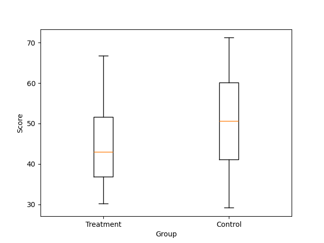
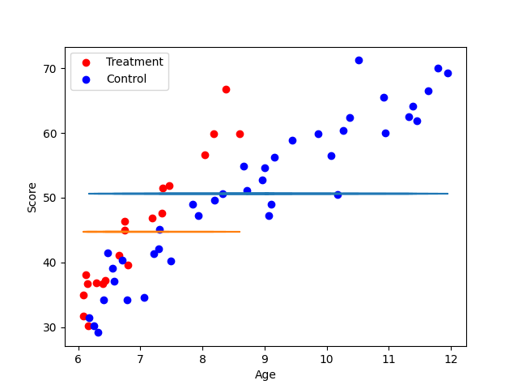
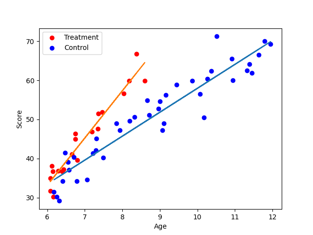

# Data_and_code_1
Exercize one of the data and code management class
The point of this analysis is to observe the correlation between age, supplementary reading course and reading abilities
The group subject to the supplementary course is called 'Treatment' and the other 'Control'
This repo contains the raw data in the reading.csv file, the code in the analysis.ipynb file and the resulting plot in the figures folder

# **Part 1** 

Our first intuition is to inspect the average reading score of both group to see if there's a significant difference

Visually we can see that the control group have a higher median than the treatment one but the boxplot overlap quite a bit, running a t-test give us a p-value=0.068 so not enough to call them statistically different at the 5% level. From the t test we can see that the groups aren't significantly different at the 5% level. This result would suggest that the treatment doesn't affect reading abilities or reduce it a little, another hypothesis is that the person on the treatment group are the one with reading problem and that the treatment doesn't compensate this natural gap. Let's investigate further

# **Part 2** 

Doing a regression on the score with only the groups as variable give us obviously a flat line

The control group line being higher also suggest that the treatment worsen the score however we can see on the scatterplot an age disparity between the two group so let's do another regression accounting for age. Score ~ Group + Age

We can now see that after accounting for age the treatment group has an higher intercept but the slope are equal. We can interpret this result as the treatment group having higher score which would contradict what a simple inspection of the boxplot suggest, but learning rate being similar to the control group.

# **Part 3** 
The slope of the 2 being equal suggest a similar learning rate but we didn't account for a possible interaction between the age and the groups let's add this to our regression Score ~ age*group + age + group

We can now see that the two variable have a closer intercept but the slope of the treatment group is much steepper than the slope of the control one. This suggest that the treatment is more effective the older the children

# **Part 4** 

For this final regression we created the variable age6 which is simply age - 6. This allow the intercept to be interpreted as the first year of the treatment program 

At the beginning of the program the average reading score is simmilar between the two group however as time passes the treatment group learn faster creating a gap that widden with time. The lack of data for children above 9y.o for the treatment group prevent us from extrapolating the result as the treatment continue.

# **Conclusion** 

We wanted to analyse the impact of additional reading class (treatment) on children reading score. At first it seems like the treatment group do worse on average but after accounting for age we realized that both group get better score as age increase and that the treatment age range is [6.1-8.6] while the control range[6.2-12] the older children in the control group artificially increase the average score compared to the treatment group. After doing regression accounting for age, group and the interaction between the two we realize that at the beginning the two group have simmilar average score but as age increase the treatment group get significantly better than the control group suggesting a positive effect of the treatment which increase with age.
